## Solving Memory Leaks Issues in Ionic Angular

### Introduction
------------------
In this article we will walk you through how to detect memory leaks in your web application and how to investigate the reasons behind those memory leaks and solve them using a real world example. We will have a journey together to get from **snapshot 1** to **snapshot 2**.

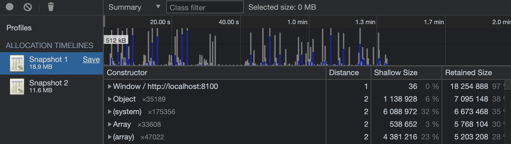

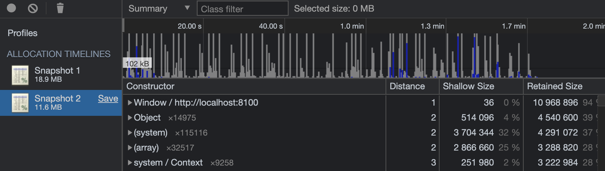

Memory leaks are one of the most challenging optimization issues to tackle, they can have multiple sources and usually you will need to find the pattern that cause a memory leak. That's why it's crucial to learn how to measure memory performance and get insights from memory allocation timelines.

### What Is A Memory Leak
----------------------

In computer science, a memory leak is a type of resource leak that occurs when a computer program incorrectly manages memory allocations in a way that memory which is no longer needed is not released [1](https://en.wikipedia.org/wiki/Memory_leak). In short, memory leak can be defined as some memory allocated that is not required anymore but not released, **i.e**,  not garbage collected.

Most modern programming languages manage memory automatically. The memory lifecycle usually consists of three steps:  
**1**. Allocate memory needed  
**2**. Read from and write to allocated memory  
**3**. Release the memory allocated as soon as it's not needed anymore  

Angular does a great job at memory management but in some cases that results from bad practices in implementation leads to memory leaks and that has a very bad impact on the user experience.

### Debugging Process
__________________________

Because the performance of our application degrades with time throughout the user session this is a strong indication of the existence of some memory leaks. To study that we needed to monitor the memory use in realtime.
#### Step 1: Monitor Memory Allocation In Real-Time

Chrome DevTools have two very helpful memory debugging tools to monitory memory allocation in real-time: 

**1.** Performance Monitor   
**2.** Record Memory Allocation Timeline Heap Snapshot  

Let's start with the performance montitor.

##### Performance monitor
If we open the performance monitor it starts recording the heap size throughout the session. We can see in the graph below that it has the shape of a **sawtooth**, the heap size is getting bigger over time and that indicates that there are some memory allocations that have not been garbage collected.

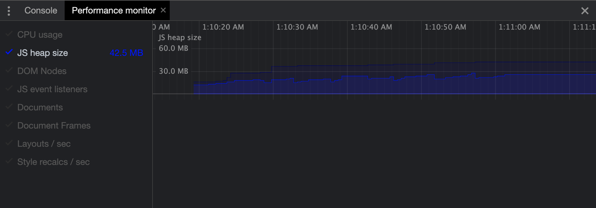

Now we need to get our hands on the objects that are not garbage collected. To find that we will take a memory allocation timeline heap snapshot

##### Recording Memory Allocation Timeline Heap Snapshot
To record a memory allocation timeline make sure to refresh the page and click on the collect garbage icon, to clean the memory from any previous session left over objects.

**Note**: in an Angular web application make sure to set the **optimization** flag in `angular.json` file to `false` in order to be able to search for the components by their names.

In the memory allocation timeline below those blue bars represent new memory allocations, and grey bars represent garbage collected memory. We can see that on each store's page we enter that memory get allocated but when we leave the page the memory is not freed and that means we have some memory leaks.

 Before we dive into finding the reason for the memory leaks, let's talk briefly about how garbage collection works in JavaScript. In Javascript resources get garbage collected when there are no references to it. That means that even if an object is not needed anymore but still referenced and accessible from another place in our application, it will not be garbage collected. This issue can't be handled by the garbage collector, it's up to the developer to clean up the refernces to the objects.
 
 
#### Step 2: Investigating The Reasons For Memory Leaks

After stopping the recording and you click on an object you can filter the objects by their names. In this page we have two components **SupplierProductsPage** and **SupplierProductCard** which is rendered inside the former page as a child component.

If we filter the objects by name we will find that we have 3x **SupplierProductsPage** objects and 60x **SupplierProductCard** objects as we show 20x products on entering the page. Also, we can see some other objects created by Angular Ivy which have a very large **Retained Size** -- i.e the size of memory that is freed once the object itself is deleted along with its dependent objects that were made unreachable from GC roots.

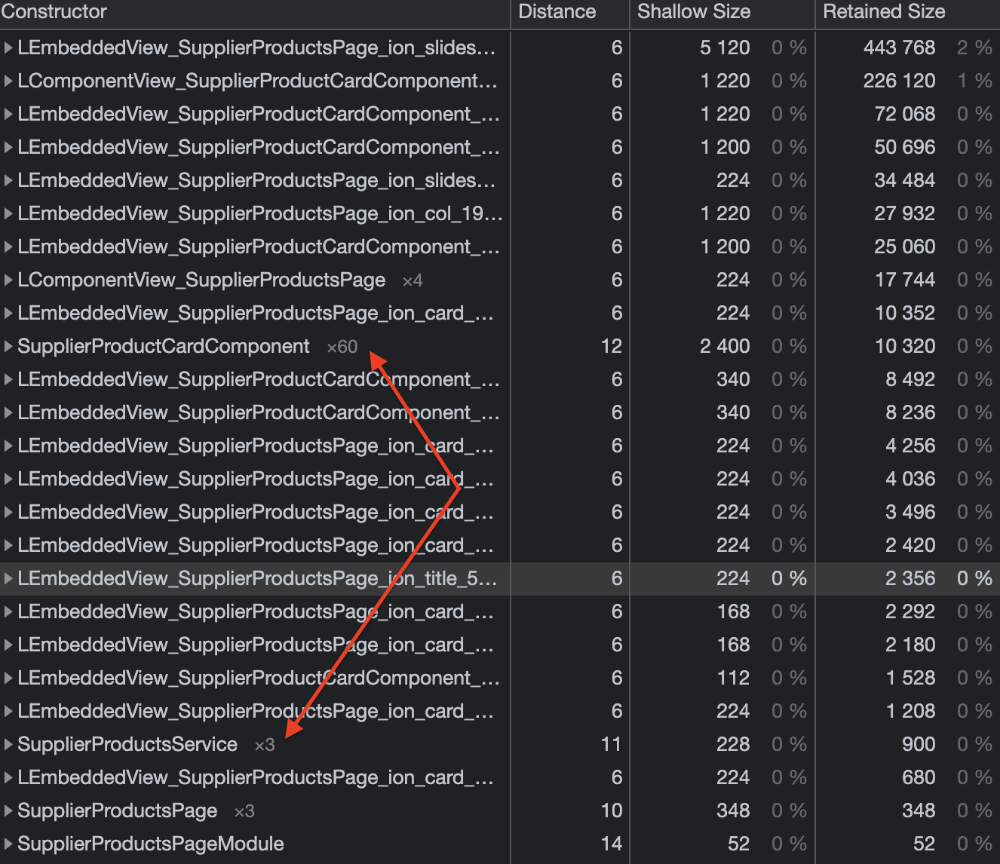

If you click on an object you will find a window get shown called **object's retaining tree**. this tree shows us the objects that have reference to the selected object.After going through the object's retaining tree of  **SupplierProductsPage** object and **SupplierProductCard** object we found that there are subscriptions to observables that are still alive and causing the memory leaks.

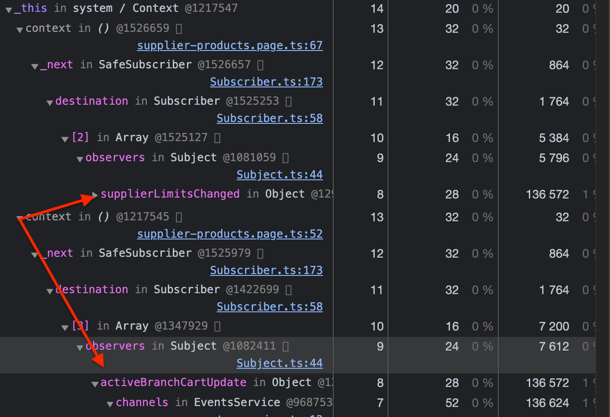

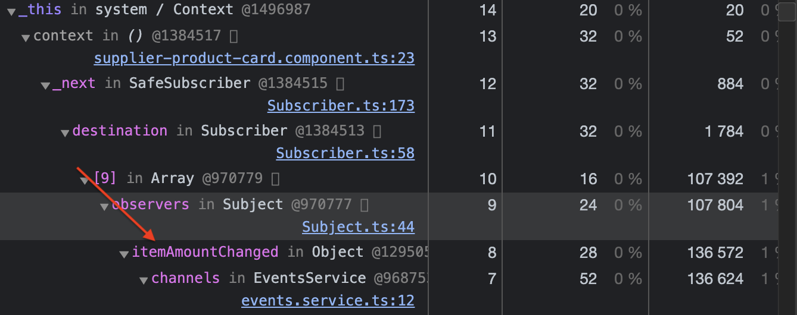

In RxJS it is very important to remember to unsubscribe from an observable for two reasons:

**1.** A subscription has a reference to the component they're created in. So, when the component gets destroyed it will not be garbage collected and that will result in a memory leak.  
**2.** The code will continue to execute in the backgorund even if the component gets destroyed, and that can result to unpredictable erros and side effects.  

The solution to this issue is quite simple yet can go unnoticed very easily. We need to hook into `ngOnDestroy` component lifecycle to clean up our subscriptions in both components before the component gets destroyed.

#### Step 3: Applying Solutions

##### Upgrading To Angular 10

We found that in Angular 9, Ivy is leaking memory and it doesn't deallocate memory of destroyed components correctly. In this [issue](https://github.com/angular/angular/issues/35148) you can find people complaining about it. So we tried upgrading to Angular 10 to see if this issue is resolved in the newer version and we found that it did get resolved.

In the heap snapshot below we can see that the **LEmbeddedView_** and **LComponentView_** don't exist anymore.

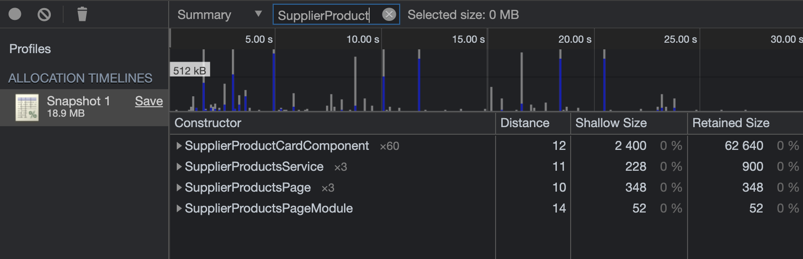

##### Result Of Unsubscribing From Observables
The subscriptions have been cleaned up, however after taking a new record for the memory allocation timeline the object's didn't get garbage collected.
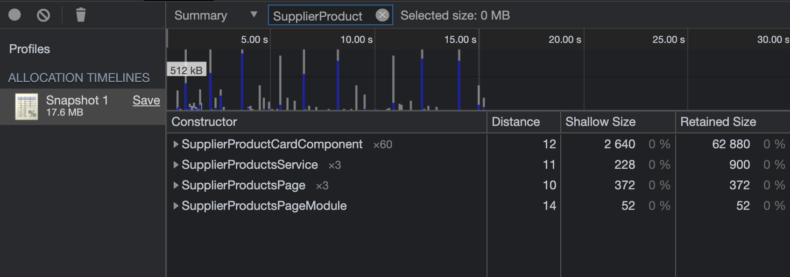

To find the reason why the objects didn't get garbage collected event after unsubscribing it took some time, because I found that the problem was not in our implementation but it's a bug in an **Ionic** component which is `ion-img`, this component lazily loads images.

##### Describing The Bug In ion-img Component

We came across this [issue](https://github.com/ionic-team/ionic-framework/issues/19242), in the comments we found that someone has reported that `ion-img` component implemented by Ionic didn't clean up its **IntersectionObserver** references properly. If you checkout the code for the [implementation](https://github.com/ionic-team/ionic-framework/blob/master/core/src/components/img/img.tsx), you will find that the IntersectionObserver don't get disconnected on the component destroy.

To confirm that we tried to use a native `img` tag and see if the components are garbage collected. We recorded a new memory allocation time line to check the number of objects for each component.

In the recording below, we can see that each time we visit a store's page the garbage collector runs and the previous memory allocations get garbage collected, and that proves that the component is the problem. 

We can see here that the number of **SupplierProductsPage** object is only x1 and the number of **SupplierProductCard** object is only x20 which is the number of product cards we render on entering the page.

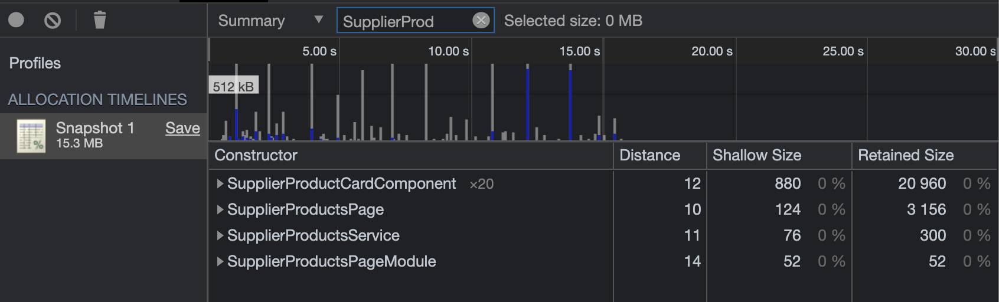

Surprisingly, when we tried to use `loading="lazy"` attribute on the native `img` tag, the issue still persists and the components don't get garbage collected.

##### Implementing Lazy Loading

Since we can't eagerly load images in all pages to avoid performance issues, we decided to implement lazy loading ourselves to make sure we disconnect from the **IntersectionObserver** on component destroy.

To avoid reinventing the wheel, we tried to look if someone has created a directive for images lazy loading and we came across this amazing [implementation](https://www.bennadel.com/blog/3366-lazy-loading-images-with-the-intersectionobserver-api-in-angular-5-0-0.htm) by [Ben Nadel](https://www.bennadel.com/about/about-ben-nadel.htm). The implementation needed to get updated because it was implemented for Angular 5 and we use Angular 10.

After Implementing lazy loading as a directive added it to the native `img` tag using IntersectionObserverAPI we had the same result as using the native `img` tag, and that's because we made sure in the implementation that we disconnect from the IntersectionObserver when the component gets destroyed.

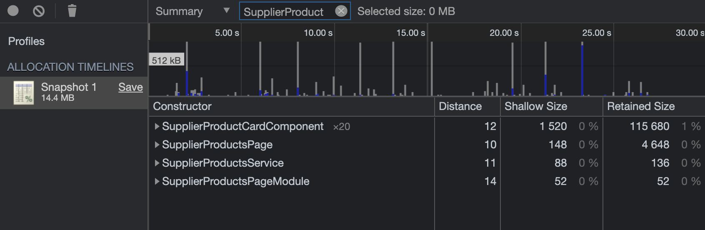

#### Results

After applying the above solutions:
- Upgrading to Angular 10
- Unsubscribing from observables on component destroy
- Removing `ion-img` component from all components and implement lazy loading

To compare the heap snapshots we tried to perform the same actions on each session, we found that the heap size in **production** mode has decreased signifacntly from 18.9mb to 11.6mb. Also, we can see that the perfromance monitor graph has improved and it shows that there are multiple drops in heap size throughout the sessions.

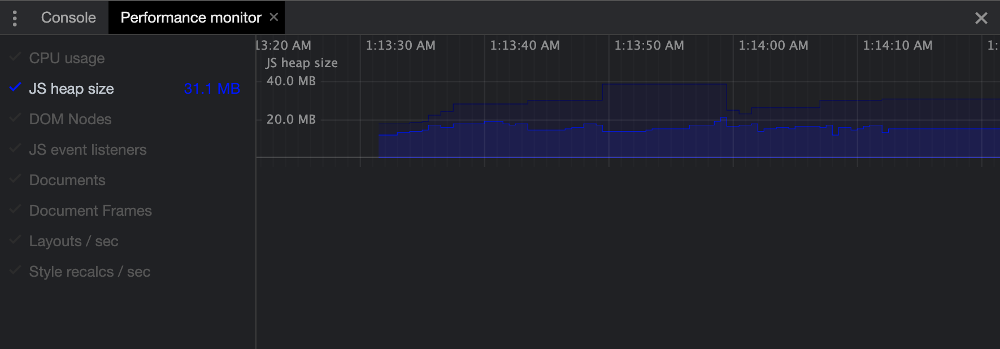
